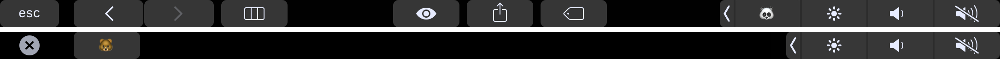

# Touch Bär



Touch Bär uses **undocumented, private API** to add a Touch Bar button to the Control Strip on the right-band side of the keyboard.

```objc
DFRElementSetControlStripPresenceForIdentifier(NSString *, BOOL);
DFRSystemModalShowsCloseBoxWhenFrontMost(BOOL);

+[NSTouchBarItem addSystemTrayItem:]
+[NSTouchBar presentSystemModalFunctionBar:systemTrayItemIdentifier:]
```

## Author

Alexsander Akers, me@a2.io

## License

Touch Bär is available under the MIT license. See the LICENSE file for more info.
